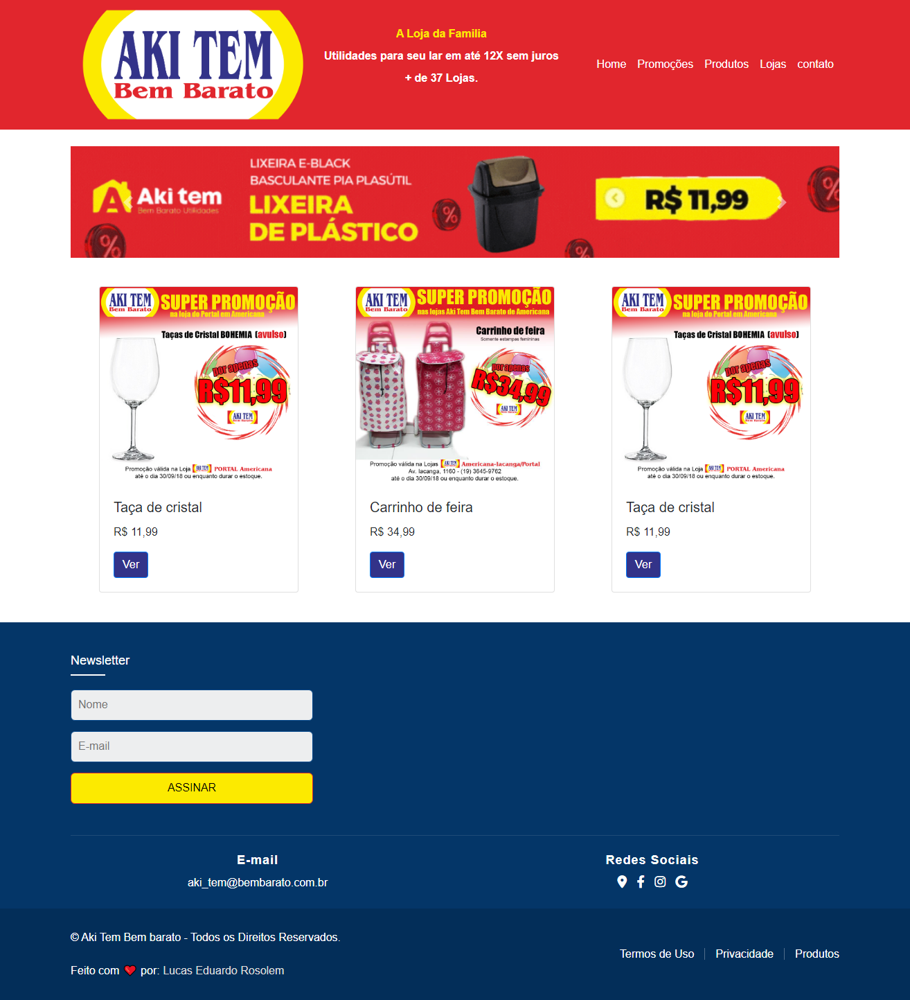

<h1 align="center"> Aki tem | Bem barato</h1>

  
  

Desafio avaliativo da disciplina Desenvolvimento Web I do Curso de <a href="https://fatecararas.cps.sp.gov.br/tecnologia-em-desenvolvimento-de-softwares-multiplataforma/">DSM- Desenvolvimento de software multiplataforma.</a>

  

 

<h3 align="center">✅ Concluído ✅</h3>

 <a href="#-Projeto">Sobre o projeto</a> •
 <a href="#-tecnologias">Tecnologias</a> • 
 <a href="#-layout">Layout</a> • 
<a href="#-Deploy-do-projeto">Deploy</a> •
<a href="#Licença">Licença</a>

## 🚀 Tecnologias

Esse projeto foi desenvolvido com as seguintes tecnologias:

  <!--  -->
  
  
  
  

## 💻 Projeto

O Projeto é uma segunda versão do [site](https://www.akitembembarato.com/lojas/portal.html), da empresa  Aki tem Bem barato, de somente uma página, para fins avaliativo da disciplina Desenvolvimento web I.

## 🔖 Layout

 

## Deploy do projeto

Confira [aqui.](https://akitembembarato.netlify.app)
---
## :memo: Licença

Esse projeto está sob a licença MIT.

---

 
Feito com ❤️ por: <a href="https://linktr.ee/lucas.007"> Lucas Eduardo Rosolem</a>

